# 🍿 Film Info Service Backend

<div align="center">


**A modern, secure, and scalable Spring Boot backend for movie management**

[](https://openjdk.java.net/)
[](https://spring.io/projects/spring-boot)
[](https://www.mysql.com/)
[](https://jwt.io/)

[]()
[](LICENSE)
[]()
[]()

[🚀 Quick Start](#-quick-start) • [📖 Documentation](#-api-documentation) • [🛠️ Installation](#️-installation) • [🤝 Contributing](#-contributing)

</div>

---

## 📋 Table of Contents

- [✨ Features](#-features)
- [🛠️ Tech Stack](#️-tech-stack)
- [🏗️ System Architecture](#️-system-architecture)
- [🚀 Quick Start](#-quick-start)
- [⚙️ Installation](#️-installation)
- [📖 API Documentation](#-api-documentation)
- [🔧 Configuration](#-configuration)
- [📊 Database Schema](#-database-schema)
- [🔐 Authentication](#-authentication)
- [🧪 Testing](#-testing)
- [📈 Performance](#-performance)
- [🐳 Docker Support](#-docker-support)
- [🤝 Contributing](#-contributing)
- [📄 License](#-license)

---

## ✨ Features

<div align="center">

| Feature | Description | Status |
|---------|-------------|--------|
| 🎬 **Movie CRUD** | Complete movie management system | ✅ |
| 📁 **File Upload** | Poster upload & retrieval | ✅ |
| 🔐 **JWT Security** | Secure authentication & authorization | ✅ |
| 📄 **Pagination** | Efficient data pagination | ✅ |
| 🔄 **Sorting** | Multi-field sorting support | ✅ |
| 🏗️ **Clean Architecture** | Three-layered design pattern | ✅ |
| 🛡️ **Role-based Access** | User & Admin role management | ✅ |
| 📊 **Database Integration** | MySQL with JPA/Hibernate | ✅ |

</div>

### 🎯 Core Capabilities

- **🎥 Movie Management**: Full CRUD operations with validation
- **📁 File Handling**: Secure poster upload and retrieval system
- **🔍 Advanced Querying**: Pagination, sorting, and filtering
- **🔐 Security**: JWT-based authentication with role-based access control
- **📊 Data Persistence**: MySQL integration with optimized queries
- **🏗️ Scalable Architecture**: Clean separation of concerns

---

## 🛠️ Tech Stack

<div align="center">

### Backend


### Database & Storage


### Security & Authentication


### Build Tools


</div>

---

## 🏗️ System Architecture

### High-Level Architecture Diagram

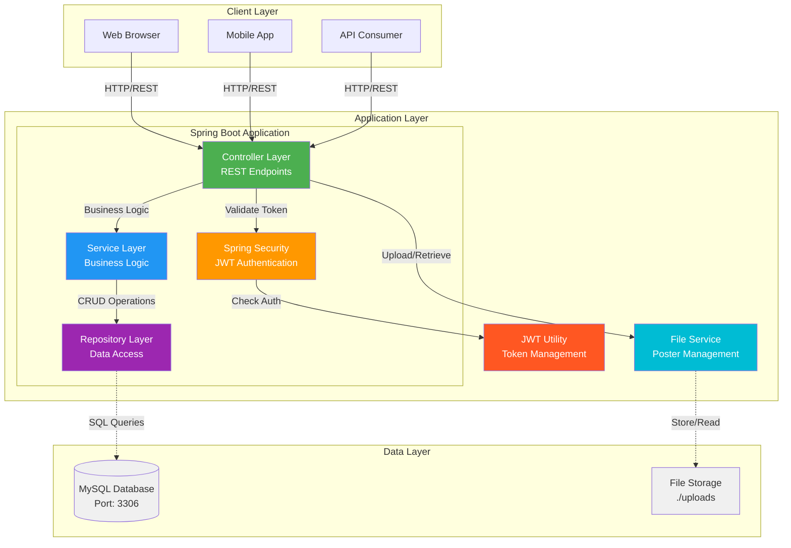

### Three-Layered Architecture Pattern

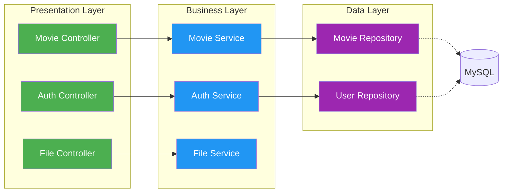

### Component Interaction Diagram

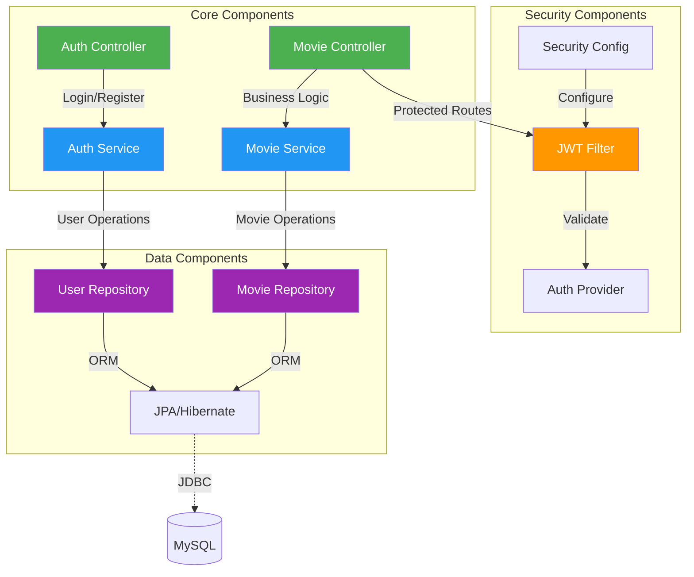

---

## 🔄 Request Flow Diagrams

### Movie Creation Flow (with File Upload)

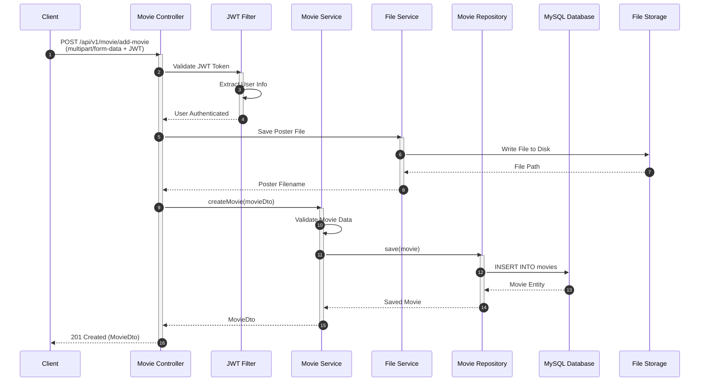

### Authentication & Authorization Flow

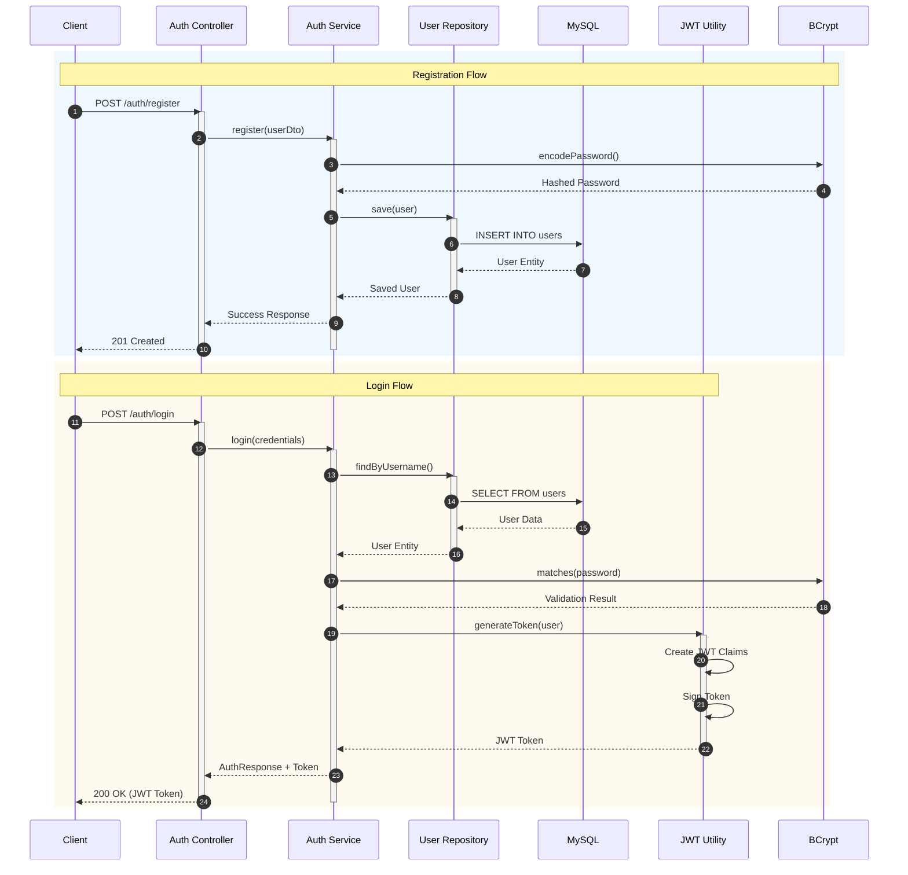

### Get All Movies with Pagination Flow

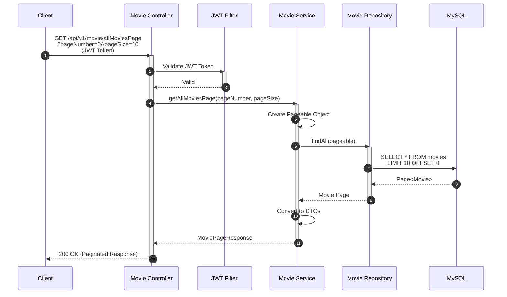

### File Retrieval Flow

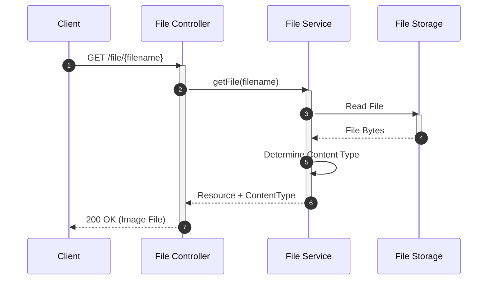

---

## 📊 Database Schema

### Entity Relationship Diagram

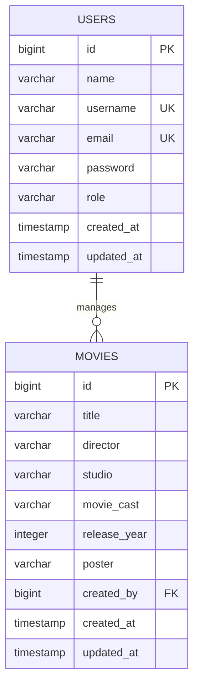

### Detailed Schema Diagram

```mermaid
graph TB
    subgraph "Users Table"
        U1[id: BIGINT PK AUTO_INCREMENT]
        U2[name: VARCHAR 100]
        U3[username: VARCHAR 50 UNIQUE]
        U4[email: VARCHAR 100 UNIQUE]
        U5[password: VARCHAR 255]
        U6[role: VARCHAR 20]
        U7[created_at: TIMESTAMP]
        U8[updated_at: TIMESTAMP]
    end
    
    subgraph "Movies Table"
        M1[id: BIGINT PK AUTO_INCREMENT]
        M2[title: VARCHAR 255 NOT NULL]
        M3[director: VARCHAR 100 NOT NULL]
        M4[studio: VARCHAR 100]
        M5[movie_cast: TEXT]
        M6[release_year: INT]
        M7[poster: VARCHAR 255]
        M8[created_by: BIGINT FK]
        M9[created_at: TIMESTAMP]
        M10[updated_at: TIMESTAMP]
    end
    
    U1 -.->|Foreign Key| M8
    
    style U1 fill:#9C27B0,color:#fff
    style M1 fill:#2196F3,color:#fff
    style M8 fill:#FF9800,color:#fff
```

### Data Flow in Repository Layer

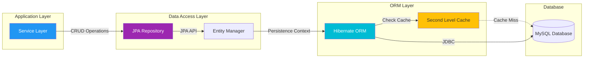

---

## 🔐 Authentication Architecture

### JWT Security Architecture

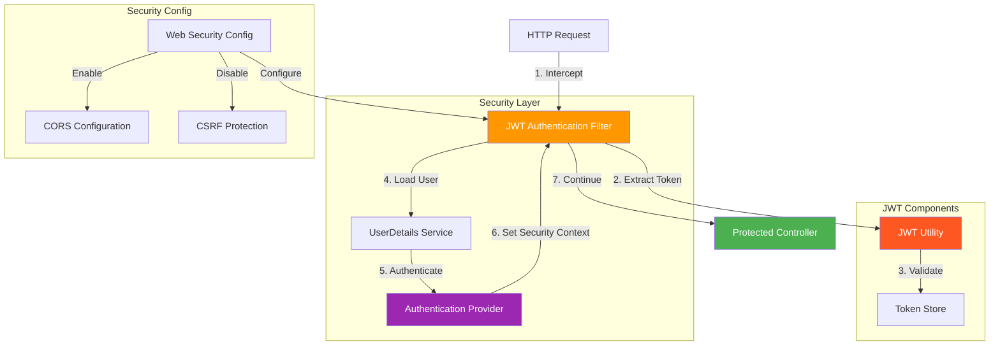

### Token Generation & Validation Flow

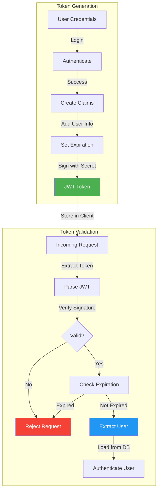

### Role-Based Access Control

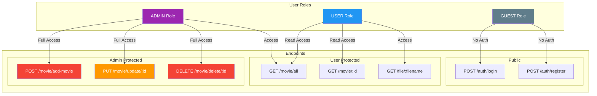

---

## 📁 Project Structure

```mermaid
graph TB
    Root[PopcornAPI Root]
    
    Root --> SrcMain[src/main]
    Root --> SrcTest[src/test]
    Root --> POM[pom.xml]
    Root --> README[README.md]
    
    SrcMain --> Java[java/com/popcornapi]
    SrcMain --> Resources[resources]
    
    Java --> Controller[controller/]
    Java --> Service[service/]
    Java --> Repository[repository/]
    Java --> Entity[entity/]
    Java --> Config[config/]
    Java --> DTO[dto/]
    Java --> Exception[exception/]
    Java --> Security[security/]
    
    Controller --> MovieCtrl[MovieController.java]
    Controller --> AuthCtrl[AuthController.java]
    Controller --> FileCtrl[FileController.java]
    
    Service --> MovieSvc[MovieService.java]
    Service --> AuthSvc[AuthService.java]
    Service --> FileSvc[FileService.java]
    
    Repository --> MovieRepo[MovieRepository.java]
    Repository --> UserRepo[UserRepository.java]
    
    Entity --> Movie[Movie.java]
    Entity --> User[User.java]
    
    Config --> SecConfig[SecurityConfig.java]
    Config --> JWTConfig[JwtConfig.java]
    Config --> WebConfig[WebConfig.java]
    
    Resources --> AppProps[application.properties]
    Resources --> DataSQL[data.sql]
    
    style Root fill:#FFC107
    style Controller fill:#4CAF50,color:#fff
    style Service fill:#2196F3,color:#fff
    style Repository fill:#9C27B0,color:#fff
    style Config fill:#FF9800,color:#fff
```

---

## 🚀 Quick Start

### Prerequisites

- ☕ **Java 17** or higher
- 🐬 **MySQL 8.0** or higher
- 🔧 **Maven 3.6** or higher

### Installation Workflow

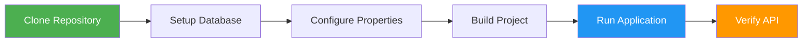

### 1️⃣ Clone & Navigate

```bash
git clone https://github.com/Prahlad-7/PopcornAPI.git
cd PopcornAPI
```

### 2️⃣ Database Setup

Create a MySQL database:

```sql
CREATE DATABASE popcorn_db;
CREATE USER 'popcorn_user'@'localhost' IDENTIFIED BY 'your_password';
GRANT ALL PRIVILEGES ON popcorn_db.* TO 'popcorn_user'@'localhost';
FLUSH PRIVILEGES;
```

### 3️⃣ Configure Application

Update `src/main/resources/application.properties`:

```properties
# Database Configuration
spring.datasource.url=jdbc:mysql://localhost:3306/popcorn_db
spring.datasource.username=popcorn_user
spring.datasource.password=your_password

# JPA Configuration
spring.jpa.hibernate.ddl-auto=update
spring.jpa.show-sql=true
spring.jpa.properties.hibernate.dialect=org.hibernate.dialect.MySQL8Dialect

# JWT Configuration
jwt.secret=your-secret-key-must-be-at-least-256-bits
jwt.expiration=86400000

# File Upload Configuration
spring.servlet.multipart.max-file-size=10MB
spring.servlet.multipart.max-request-size=10MB
file.upload-dir=./uploads
```

### 4️⃣ Build & Run

```bash
# Clean and build
./mvnw clean install

# Run the application
./mvnw spring-boot:run
```

### 5️⃣ Access the API

- **Base URL**: `http://localhost:8080`
- **Health Check**: `GET /actuator/health`
- **API Documentation**: `http://localhost:8080/swagger-ui.html`

---

## 📖 API Documentation

### API Endpoint Map

```mermaid
graph TB
    API[PopcornAPI Base URL<br/>http://localhost:8080]
    
    API --> Auth[/api/v1/auth]
    API --> Movie[/api/v1/movie]
    API --> File[/file]
    
    Auth --> Register[POST /register]
    Auth --> Login[POST /login]
    
    Movie --> AddMovie[POST /add-movie 🔒]
    Movie --> GetAll[GET /all 🔒]
    Movie --> GetById[GET /:id 🔒]
    Movie --> Update[PUT /update/:id 🔒]
    Movie --> Delete[DELETE /delete/:id 🔒]
    Movie --> Paginated[GET /allMoviesPage 🔒]
    Movie --> Sorted[GET /allMoviesPageSort 🔒]
    
    File --> GetPoster[GET /:filename]
    
    style API fill:#FFC107
    style Auth fill:#9C27B0,color:#fff
    style Movie fill:#4CAF50,color:#fff
    style File fill:#2196F3,color:#fff
    style Register fill:#00BCD4,color:#fff
    style Login fill:#00BCD4,color:#fff
```

### 🎬 Movie Endpoints

<details>
<summary>Click to expand Movie API details</summary>

#### Create Movie
```http
POST /api/v1/movie/add-movie
Content-Type: multipart/form-data
Authorization: Bearer {token}

{
    "title": "The Matrix",
    "director": "The Wachowskis",
    "studio": "Warner Bros",
    "movieCast": "Keanu Reeves, Laurence Fishburne",
    "releaseYear": 1999,
    "poster": file
}
```

**Response:**
```json
{
    "id": 1,
    "title": "The Matrix",
    "director": "The Wachowskis",
    "studio": "Warner Bros",
    "movieCast": "Keanu Reeves, Laurence Fishburne",
    "releaseYear": 1999,
    "poster": "matrix-poster.jpg",
    "posterUrl": "http://localhost:8080/file/matrix-poster.jpg"
}
```

#### Get All Movies
```http
GET /api/v1/movie/all
Authorization: Bearer {token}
```

#### Get Movie by ID
```http
GET /api/v1/movie/{id}
Authorization: Bearer {token}
```

#### Update Movie
```http
PUT /api/v1/movie/update/{id}
Content-Type: multipart/form-data
Authorization: Bearer {token}

{
    "title": "The Matrix Reloaded",
    "director": "The Wachowskis",
    "studio": "Warner Bros",
    "movieCast": "Keanu Reeves, Laurence Fishburne",
    "releaseYear": 2003,
    "poster": file
}
```

#### Delete Movie
```http
DELETE /api/v1/movie/delete/{id}
Authorization: Bearer {token}
```

#### Paginated Movies
```http
GET /api/v1/movie/allMoviesPage?pageNumber=0&pageSize=10
Authorization: Bearer {token}
```

**Response:**
```json
{
    "content": [...],
    "pageNumber": 0,
    "pageSize": 10,
    "totalElements": 50,
    "totalPages": 5,
    "last": false
}
```

#### Sorted Movies
```http
GET /api/v1/movie/allMoviesPageSort?sortBy=title&pageNumber=0&pageSize=10
Authorization: Bearer {token}
```

</details>

### 🔐 Authentication Endpoints

<details>
<summary>Click to expand Auth API details</summary>

#### Register User
```http
POST /api/v1/auth/register
Content-Type: application/json

{
    "name": "John Doe",
    "username": "johndoe",
    "email": "john@example.com",
    "password": "securePassword123"
}
```

**Response:**
```json
{
    "message": "User registered successfully",
    "userId": 1,
    "username": "johndoe"
}
```

#### Login User
```http
POST /api/v1/auth/login
Content-Type: application/json

{
    "username": "johndoe",
    "password": "securePassword123"
}
```

**Response:**
```json
{
    "token": "eyJhbGciOiJIUzI1NiIsInR5cCI6IkpXVCJ9...",
    "type": "Bearer",
    "username": "johndoe",
    "email": "john@example.com",
    "role": "USER",
    "expiresIn": 86400000
}
```

</details>

### 📁 File Endpoints

<details>
<summary>Click to expand File API details</summary>

#### Get Poster
```http
GET /file/{filename}
```

**Response:** Image file (JPEG, PNG, etc.)


